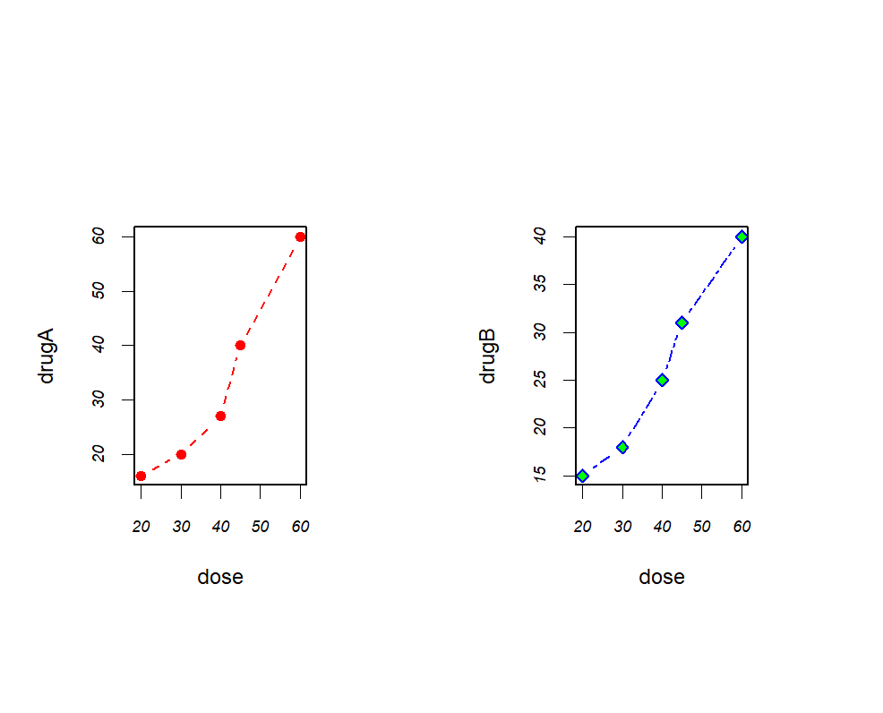

EMPEZANDO A TRABAJAR CON GRÁFICOS
=======================

### Carlos Mantilla

### 2017-10-15

Algo importante y que muchas veces no se hace es el análisis gráfico.
En la mayoría de los casos se le suele dar más importancia a la presentación de tablas y resúmenes numéricos. Sin embargo, el uso de gráficos llega a ofrecer información que puede ser empleada para fortalecer el análisis o para comprender mejor el fenómeno estudiado  antes de proceder al procesamiento de datos. Veamos un ejemplo simple de un gráfico:

Primero revisemos que no existan objetos previamente creados
```r
> ls()
```

```
[1] "ChooseOutputFormat" "fig.files"          "lines"             
[4] "rmdDir"             "saveDir"           
```
Si los hay, ¿cómo procedemos?

```r
> rm(list=ls(all=TRUE))
```

Una vez se ha limpiado el área de trabajo, procedemos a cargar los datos. Para el ejemplo, usaremos una base de datos suministrada por R:

```r
> head(mtcars)
```

```
                   mpg cyl disp  hp drat    wt  qsec vs am gear carb
Mazda RX4         21.0   6  160 110 3.90 2.620 16.46  0  1    4    4
Mazda RX4 Wag     21.0   6  160 110 3.90 2.875 17.02  0  1    4    4
Datsun 710        22.8   4  108  93 3.85 2.320 18.61  1  1    4    1
Hornet 4 Drive    21.4   6  258 110 3.08 3.215 19.44  1  0    3    1
Hornet Sportabout 18.7   8  360 175 3.15 3.440 17.02  0  0    3    2
Valiant           18.1   6  225 105 2.76 3.460 20.22  1  0    3    1
```
```r
> ?mtcars
```

```r
> attach(mtcars)
> plot(wt, mpg)
> abline(lm(mpg~wt))
> title("Regresión: MPG|Weight")
> detach(mtcars)
```


Podemos guardar las gráficas. Para lo cual tenemos varias opciones:
1. Usando el menú contextual
2. Mediante el uso de comandos
```r
> pdf("ejemplo.pdf")
> attach(mtcars)
> plot(wt, mpg)
> abline(lm(mpg~wt))
> title("Regression of MPG on Weight")
> detach(mtcars)
> dev.off()
```
También se puede emplear:
```r
> # win.metafile()
> # png()
> # jpeg()
> # bmp()
> # tiff()
> # xfig()
> # postscript()
```
```r
> tiff("ejemplo.tiff")
> attach(mtcars)
> plot(wt, mpg)
> abline(lm(mpg~wt))
> title("Regresión MPG|Weight")
> detach(mtcars)
> dev.off()
```
La anterior línea de comandos guarda la imagen en el directorio de trabajo

Vamos, ahora, a definir algunos parámetros gráficos.
Para ello, usemos un ejemplo corto tomado de la literatura.
Dos drogas y sus dosis:
```r
# +--------------------------------------------------+
# | Dosage | Response to Drug A | Response to Drug B |
# +--------+--------------------+--------------------+
# |   20   |         16         |          15        |
# |   30   |         20         |          18        |
# |   40   |         27         |          25        |
# |   45   |         40         |          31        |
# |   60   |         60         |          40        |
# +--------------------------------------------------+
```
```r
> dose <- c(20, 30, 40, 45, 60)
> drugA <- c(16, 20, 27, 40, 60)
> drugB <- c(15, 18, 25, 31, 40)
> plot(dose, drugA, type="b")
```


La siguiente línea de comandos

```r
> opar <- par(no.readonly=TRUE)
> par(lty=2, pch=17)
> plot(dose, drugA, type="b")
> par(opar)
```

Produce el siguiente resultado


Y
```r
> plot(dose, drugA, type="b", lty=2, pch=17)
```
Produce el mismo resultado.
Se pueden cambiar algunos argumentos para obtener otros resultados

```r
> plot(dose, drugA, type="b", lty=3, lwd=3, pch=15, cex=2)
```


veamos, ahora, ejemplos de colores

```r
> library(RColorBrewer)
> n <- 7
> mycolors <- brewer.pal(n, "Set1")
> barplot(rep(1,n), col=mycolors)
```


```r
> n <- 10
> mycolors <- rainbow(n)
> pie(rep(1, n), labels=mycolors, col=mycolors)
```


```r
> mygrays <- gray(0:n/n)
> pie(rep(1, n), labels=mygrays, col=mygrays)
```


Retomemos el ejemplo de las dos drogas:

```r
> dose <- c(20, 30, 40, 45, 60)
> drugA <- c(16, 20, 27, 40, 60)
> drugB <- c(15, 18, 25, 31, 40)
```
```r
> opar <- par(no.readonly=TRUE)
> par(pin=c(2, 3))
> par(lwd=2, cex=1.5)
> par(cex.axis=.75, font.axis=3)
> plot(dose, drugA, type="b", pch=19, lty=2, col="red")
> plot(dose, drugB, type="b", pch=23, lty=6, col="blue", bg="green")
> par(opar)
```


```r
> plot(dose, drugA, type="b",
+ col="red", lty=2, pch=2, lwd=2,
+ main="Pruebas Clínicas para Droga A",
+ sub="Estos son Datos Hipotéticos",
+ xlab="Dosis", ylab="Respuesta de la Droga",
+ xlim=c(0, 60), ylim=c(0, 70))
```


También se puede agregar eñl título usando:

```r
> title(main="My Title", col.main="red",
+ sub="My Subtitle", col.sub="blue",
+ xlab="My X label", ylab="My Y label",
+ col.lab="green", cex.lab=0.75)
```
Veamos algo más creativo:

```r
> x <- c(1:10)
> y <- x
> z <- 10/x
> opar <- par(no.readonly=TRUE)
> par(mar=c(5, 4, 4, 8) + 0.1)
> plot(x, y, type="b",
+ pch=21, col="red",
+ yaxt="n", lty=3, ann=FALSE)
> lines(x, z, type="b", pch=22, col="blue", lty=2)
> axis(2, at=x, labels=x, col.axis="red", las=2)
> axis(4, at=z, labels=round(z, digits=2),
+ col.axis="blue", las=2, cex.axis=0.7, tck=-.01)
> mtext("y=1/x", side=4, line=3, cex.lab=1, las=2, col="blue")
> title("An Example of Creative Axes",
+ xlab="X values",
+ ylab="Y=X")
> par(opar)
```

```r
> dev.off()
```

Pongamos la leyenda y grafiquemos ambos casos

```r
> dose <- c(20, 30, 40, 45, 60)
> drugA <- c(16, 20, 27, 40, 60)
> drugB <- c(15, 18, 25, 31, 40)
> opar <- par(no.readonly=TRUE)
> par(lwd=2, cex=1.5, font.lab=2)
> plot(dose, drugA, type="b",
+ pch=15, lty=1, col="red", ylim=c(0, 60),
+ main="Drug A vs. Drug B",
+ xlab="Drug Dosage", ylab="Drug Response")
> lines(dose, drugB, type="b",
+ pch=17, lty=2, col="blue")
> abline(h=c(30), lwd=1.5, lty=2, col="gray")
> library(Hmisc)
> minor.tick(nx=3, ny=3, tick.ratio=0.5)
> legend("topleft", inset=.05, title="Drug Type", c("A","B"),
+ lty=c(1, 2), pch=c(15, 17), col=c("red", "blue"))
> par(opar)
```


```r
> attach(mtcars)
> plot(wt, mpg,
+ main="Mileage vs. Car Weight",
+ xlab="Weight", ylab="Mileage",
+ pch=18, col="blue")
> text(wt, mpg,
+ row.names(mtcars),
+ cex=0.6, pos=4, col="red")
> detach(mtcars)
```


```r
> opar <- par(no.readonly=TRUE)
> par(cex=1.5)
```


```r
> plot(1:7,1:7,type="n")
```


```r
> text(3,3,"Example of default text")
```

```
Error in text.default(3, 3, "Example of default text"): plot.new has not been called yet
```


```r
> text(4,4,family="mono","Example of mono-spaced text")
```

```
Error in text.default(4, 4, family = "mono", "Example of mono-spaced text"): plot.new has not been called yet
```


```r
> text(5,5,family="serif","Example of serif text")
```

```
Error in text.default(5, 5, family = "serif", "Example of serif text"): plot.new has not been called yet
```


```r
> par(opar)
```


```r
> attach(mtcars)
```

```
The following object is masked from package:ggplot2:

    mpg
```


```r
> opar <- par(no.readonly=TRUE)
```


```r
> par(mfrow=c(2,2))
```


```r
> plot(wt,mpg, main="Scatterplot of wt vs. mpg")
```


```r
> plot(wt,disp, main="Scatterplot of wt vs. disp")
```


```r
> hist(wt, main="Histogram of wt")
```


```r
> boxplot(wt, main="Boxplot of wt")
```


```r
> par(opar)
```


```r
> detach(mtcars)
```


```r
> attach(mtcars)
```

```
The following object is masked from package:ggplot2:

    mpg
```


```r
> opar <- par(no.readonly=TRUE)
```


```r
> par(mfrow=c(3,1))
```


```r
> hist(wt)
```


```r
> hist(mpg)
```


```r
> hist(disp)
```


```r
> par(opar)
```


```r
> detach(mtcars)
```


```r
> dev.off()
```

```
pdf 
  4 
```


```r
> attach(mtcars)
```

```
The following object is masked from package:ggplot2:

    mpg
```


```r
> layout(matrix(c(1,1,2,3), 2, 2, byrow = TRUE))
```


```r
> hist(wt)
```


```r
> hist(mpg)
```


```r
> hist(disp)
```


```r
> detach(mtcars)
```


```r
> attach(mtcars)
```

```
The following object is masked from package:ggplot2:

    mpg
```


```r
> layout(matrix(c(1, 1, 2, 3), 2, 2, byrow = TRUE),
+ widths=c(3, 1), heights=c(1, 2))
```


```r
> hist(wt)
```


```r
> hist(mpg)
```


```r
> hist(disp)
```


```r
> detach(mtcars)
```


```r
> opar <- par(no.readonly=TRUE)
> par(fig=c(0, 0.8, 0, 0.8))
> plot(mtcars$wt, mtcars$mpg, xlab="Miles Per Gallon", ylab="Car Weight")
```


```r
> par(fig=c(0, 0.8, 0.55, 1), new=TRUE)
```

```
Warning in par(fig = c(0, 0.8, 0.55, 1), new = TRUE): llamada par(new=TRUE)
sin gráfico
```

```r
> boxplot(mtcars$wt, horizontal=TRUE, axes=FALSE)
```


```r
> par(fig=c(0.65, 1, 0, 0.8), new=TRUE)
```

```
Warning in par(fig = c(0.65, 1, 0, 0.8), new = TRUE): llamada par(new=TRUE)
sin gráfico
```

```r
> boxplot(mtcars$mpg, axes=FALSE)
```


```r
> mtext("Enhanced Scatterplot", side=3, outer=TRUE, line=-3)
```

```
Error in mtext("Enhanced Scatterplot", side = 3, outer = TRUE, line = -3): plot.new has not been called yet
```
```r
> par(opar)
```
